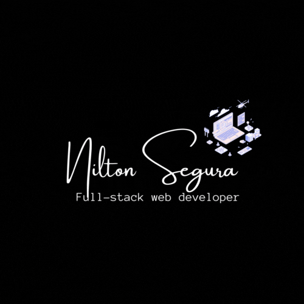

<a name="readme-top"></a>

<div align="center">
  <!-- You are encouraged to replace this logo with your own! Otherwise you can also remove it. -->
  
  <br/>
</div>

# 📗 Table of Contents

- [📗 Table of Contents](#-table-of-contents)
- [📖 Best Sellers Books ](# Best Sellers Books-)
  - [🛠 Built With ](#-built-with-)
    - [Tech Stack ](#tech-stack-)
    - [Key Features ](#key-features-)
  - [🚀 Live Demo ](#-live-demo-)
  - [💻 Getting Started ](#-getting-started-)
    - [Prerequisites](#prerequisites)
    - [Setup](#setup)
    - [Install](#install)
    - [Usage](#usage)
    - [Run tests](#run-tests)
    - [Deployment](#deployment)
  - [👥 Authors ](#-authors-)
  - [🔭 Future Features ](#-future-features-)
  - [🤝 Contributing ](#-contributing-)
  - [⭐️ Show your support ](#️-show-your-support-)
  - [🙏 Acknowledgments ](#-acknowledgments-)
  - [📝 License ](#-license-)

<!-- PROJECT DESCRIPTION -->

#  Best Sellers Books<a name="about-project"></a>

> Best Sellers Books is a website with this functionalities: display a list of books,  add a book and remove a selected book.

## 🛠 Built With <a name="built-with"></a>

### Tech Stack <a name="tech-stack"></a>

> This project uses the following stack :

<details>
  <summary>Client</summary>
  <ul>
    <li><a href="https://www.w3schools.com/html/">HTML</a></li>
    <li><a href="https://www.w3schools.com/css/">CSS</a></li>
     <li><a href="https://www.w3schools.com/js/">JavaScript</a></li>
     <li><a href="hhttps://reactjs.org/">ReactJs</a></li>
  </ul>
</details>

<!-- Features -->

### Key Features <a name="key-features"></a>

> Here are some key features of the application :

- **Learn how to use proper ES6 syntax.**
- **Use ES6 modules to write modular JavaScript.**
- **Follow Gitflow.**
- **Handle events in a React app.**
- **Use React life cycle methods.**
- **Understand the mechanism of lifting state up.**
- **Use React Router.**
- **Understand the concept of state management.**
- **Use store, actions, and reducers in React.**
- **Connect an existing API via Redux and use the data to display something in a UI.**

<p align="right">(<a href="#readme-top">back to top</a>)</p>

<!-- LIVE DEMO -->

## 🚀 Live Demo <a name="live-demo"></a>

[Comming Soon](https://github.com/Nkaleth/best_sellers_books)


<!-- > Here you can visit my live demo : -->

<p align="right">(<a href="#readme-top">back to top</a>)</p>

<!-- GETTING STARTED -->

## 💻 Getting Started <a name="getting-started"></a>

> Clone the repository by clicking on the 'Code' button and copy the link

To get a local copy up and running, follow these steps.

### Prerequisites

In order to run this project you need:

-visual studio
-github

### Setup

Clone this repository to your desired folder:

```sh
  mkdir my-folder
  cd my-folder
  git clone https://github.com/Nkaleth/bookstore.git
```

-

### Install

Install this project with:

```
  npm install
```
### Usage I

Change the main branch to the right one, execute the following command:

```sh
  git checkout dev
```

### Usage II

To run the project, execute the following command:

```sh
  npm start
```

### Run tests

To run tests, run the following command:

Example command:

To run the webhint linter

```sh
  npx hint .
```

To run the stylehint linter

```sh
  npx stylehint "**/*.{css,scss}"
```

To run the ESLint linter

```sh
  npx eslint "**/*.{js,jsx}" 
```

<p align="right">(<a href="#readme-top">back to top</a>)</p>

<!-- AUTHORS -->

## 👥 Author <a name="author"></a>

👤 **Nilton Segura**

- GitHub: [@Nkaleth](https://github.com/Nkaleth)
- Twitter: [@NoeSeguraL](https://twitter.com/NoeSeguraL)
- LinkedIn: [LinkedIn](https://www.linkedin.com/in/nseguralu/)

<p align="right">(<a href="#readme-top">back to top</a>)</p>

<!-- FUTURE FEATURES -->

## 🔭 Future Features <a name="future-features"></a>

- **Deploy**

<p align="right">(<a href="#readme-top">back to top</a>)</p>

<!-- CONTRIBUTING -->

## 🤝 Contributing <a name="contributing"></a>

Contributions, issues, and feature requests are welcome!

Feel free to check the [issues page](../../issues/).

<p align="right">(<a href="#readme-top">back to top</a>)</p>

<!-- SUPPORT -->

## ⭐️ Show your support <a name="support"></a>

If you like this project follow me and star it!

<p align="right">(<a href="#readme-top">back to top</a>)</p>

<!-- ACKNOWLEDGEMENTS -->

## 🙏 Acknowledgments <a name="acknowledgements"></a>

I would like to thank Microverse<br>

<p align="right">(<a href="#readme-top">back to top</a>)</p>
<!-- LICENSE -->

## 📝 License <a name="license"></a>

This project is [licensed](./MIT.md) .

<p align="right">(<a href="#readme-top">back to top</a>)</p>
